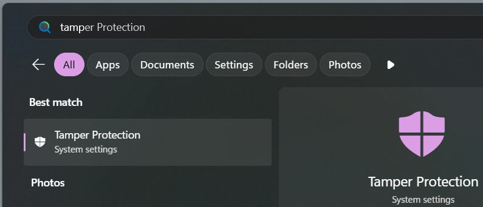
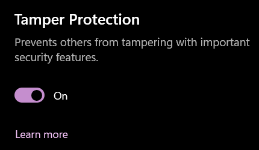
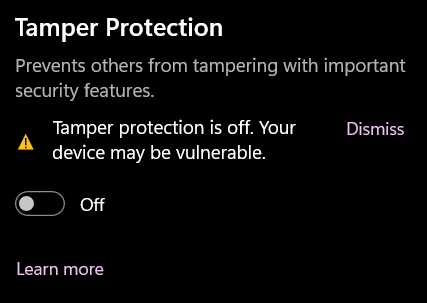
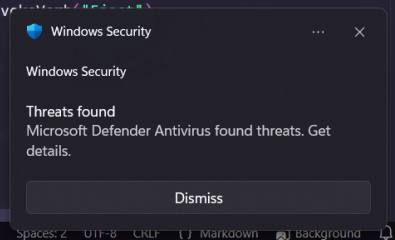
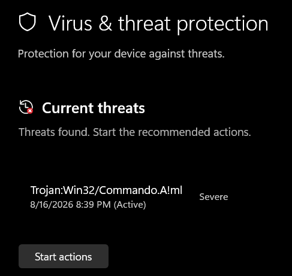
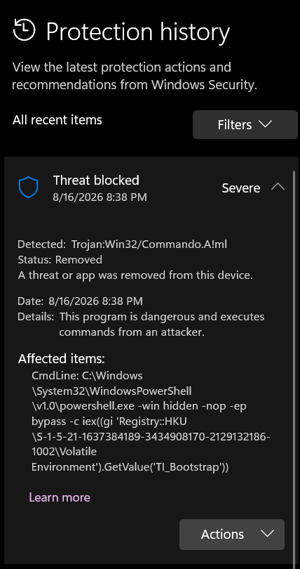

# issue

- [x] issue 2026-08-16-203535
  - where: demand/Web/Start-WebZoicwareRemoveWindowsAi
  - description: Commands in zoicware's RemoveWindowsAI script trigger Windows Defender's machine-learning-based threat detection by resembling the actions taken by a trojan virus.
  - solution 2026-08-16-204446
    - howto
      1. Make sure you're running this command in a safe environment.
      2. Disable **Tamper Protection**, run the command, and then immediately re-enable it afterward.

         
         
         

  - actual

    ```text
    [ * WARNING ] Failed to stop TrustedInstaller.exe... Using fallback method!
    Access is denied. (Exception from HRESULT: 0x80070005
    (E_ACCESSDENIED))
    At line:226 char:9
    +         $wshell.Run(
    +         ~~~~~~~~~~~~
        + CategoryInfo          : OperationStopped: (:) [],
       UnauthorizedAccessException
        + FullyQualifiedErrorId : System.UnauthorizedAccessE
       xception
    ```

    
    
    

  - link
    - Windows Defender uses machine-learning heuristics to identify potential threats, identified with a "!ml" label
      - url: <https://sensorstechforum.com/trojan-commando-aml/>
      - retrieved: 2026-08-16
    - Zoicware refuses to "fix" issues related to ani-virus interference
      - url: <https://github.com/zoicware/RemoveWindowsAI/issues/140>
      - retrieved: 2026-08-16

- [x] issue 2026-03-26-182735
  - where: demand/SystemSetupProfile/Get-...
  - solution

    ```powershell
    $driveEject = New-Object -ComObject Shell.Application
    $driveEject.Namespace(17).ParseName("$driveLetter`:\").InvokeVerb("Eject")
    ```

  - howto

    ```powershell
    Get-Volume -DriveLetter $driveLetter |
      ForEach-Object {
          $_ | Get-Partition | Get-Disk
      } |
      Set-Disk -IsOffline $true
    ```

  - actual

    ```text
    Set-Disk: Not Supported
    
    Extended information:
    Removable media cannot be set to offline.
    
    
    Activity ID: {705b985d-bcd0-0002-51c2-0071d0bcdc01}
    ```

- [x] issue 2026-03-23-030236
  - retrieved: 2022-08-02
  - description: after removing Photos app, cannot change default program for jpeg (\*.jpg) files
  - howto

    ```powershell
    Remove-AppxPackage -Name Microsoft.Windows.Photos
    ```

  - link
    - url: <https://learn.microsoft.com/en-us/answers/questions/4251953/widows-11-setting-default-program-for-jpg-files-is?forum=windows-all&referrer=answers>
    - retrieved: 2026-03-23

---

[← Go Back](../readme.md)

